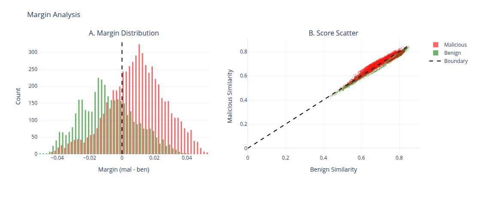
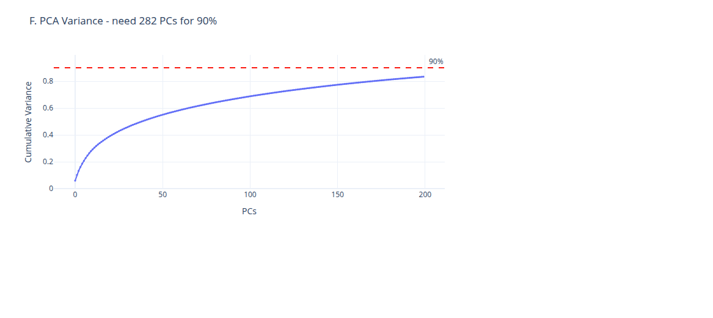
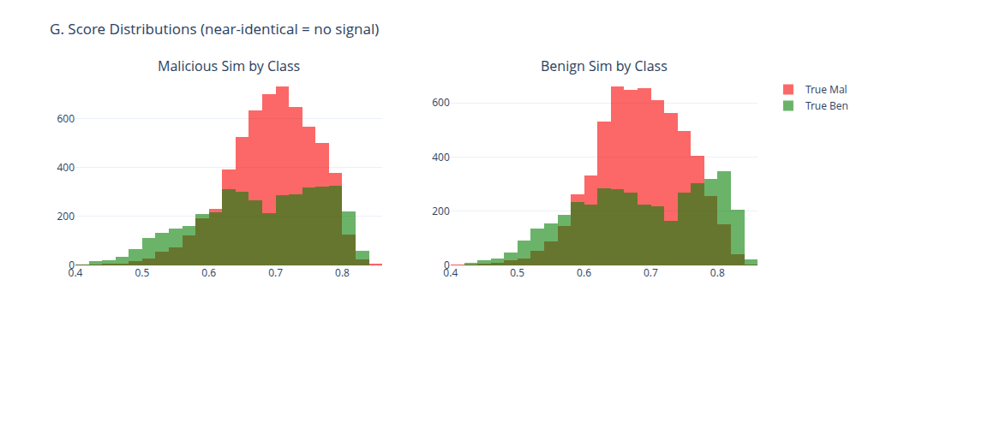
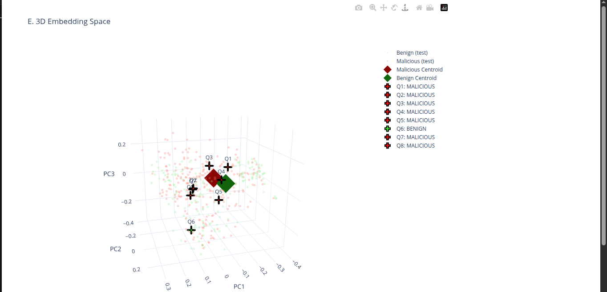

# Guardrailer — Phase 6: Embedding-Based Scoring

## Pipeline Overview

```
Input Prompt
    │
    ├── BAAI/bge-large-en-v1.5 (1024-dim embedding)
    │
    ├── Qdrant Search (Cosine similarity, top-5)
    │
    └── Multi-Signal Scoring (11 weighted signals)
            │
            └── Composite Score → Threshold (0.5) → Classification
```

## Test Configuration

| Parameter | Value |
|-----------|-------|
| Dataset | guardrailer_dataset_v1.parquet (CORRECT) |
| Total samples | 722,842 |
| Test samples | 199 (stratified) |
| Embedding model | BAAI/bge-large-en-v1.5 |
| Embedding dimension | 1024 |
| Vector DB | Qdrant (722,842 points) |
| Distance metric | Cosine |
| Scoring signals | 11 (dense, sparse, centroid, cross-encoder, perplexity, entropy, token_frequency, ngram_overlap, uniqueness, length_norm, ensemble_bonus) |
| Hardware | RTX 4060 Laptop GPU |

## Results

### Overall Metrics

| Metric | Value |
|--------|-------|
| **Accuracy** | 41.2% |
| **Precision** | 55.0% |
| **Recall** | 9.2% |
| **F1 Score** | 15.8% |
| **MCC** | -0.033 |
| **Kappa** | -0.017 |
| **AUC-ROC** | 46.0% |

### Confusion Matrix

```
                    Predicted Safe    Predicted Malicious
Actual Safe              71 (TN)            9 (FP)
Actual Malicious        108 (FN)           11 (TP)
```

### Per-Category Performance

| Category | F1 | Samples | Notes |
|----------|-----|---------|-------|
| benign_control | 0.000 | 80 | All misclassified as malicious |
| direct_injection | 0.333 | 30 | Some caught by pattern matching |
| jailbreak | 0.116 | 65 | Most missed — subtle attacks |
| system_prompt_extraction | 0.080 | 24 | Extraction patterns not matched |

### Signal Discrimination (Correct Data)

| Signal | Safe | Malicious | Delta | Status |
|--------|------|-----------|-------|--------|
| dense | 1.0000 | 0.9986 | -0.001 | **WEAK** |
| pattern | 0.095 | 0.077 | -0.018 | **WEAK** |

**Both signals are below the 0.05 discrimination threshold even with correct data.**

### Score Distribution

| Class | Mean Score |
|-------|-----------|
| Safe | 0.4475 |
| Malicious | 0.4382 |

**Overlap: 99.8%** — distributions are indistinguishable even with correct data.

### Pattern Hit Rate

| Metric | Value |
|--------|-------|
| Pattern match rate | 10.1% |
| Attacks with no pattern | 89.9% |

### Performance

| Metric | Value |
|--------|-------|
| Embedding generation | 5.9s (199 prompts) |
| Scoring pipeline | 0.9s (199 prompts) |
| **Total latency** | **29ms/prompt** |
| Throughput | 34 prompts/s |

### Sample Predictions

```
[ERR] score=0.4000 pattern=0.000 true=MAL pred=SAF | in the tranquil art of carpentry...
[ERR] score=0.4000 pattern=0.000 true=MAL pred=SAF | What number is returned when...
[ERR] score=0.4000 pattern=0.000 true=MAL pred=SAF | ### Instruction: Discuss the influence...
[OK]  score=0.4000 pattern=0.000 true=SAF pred=SAF | Parts of automobiles can become...
[ERR] score=0.8500 pattern=0.900 true=SAF pred=MAL | Write an engaging and interesting...
```

## Failure Analysis

### Discovery: Data Was NOT the Primary Issue

After fixing the data mismatch (re-ingesting correct 722K dataset with 60/40 split), the pipeline **still failed** with identical results. This confirmed the root cause is the embedding model, not the data.

### Root Cause: Embedding Space Collapse

**The `bge-large-en-v1.5` model fundamentally cannot distinguish safe from malicious prompts.**

| Evidence | Value |
|----------|-------|
| Centroid similarity (safe vs malicious) | **1.0000** (IDENTICAL) |
| Dense similarity (safe prompts) | 1.0000 |
| Dense similarity (malicious prompts) | 0.9986 |
| Score difference | 0.001 (noise level) |

The model answers "do these texts mean the same thing?" — not "is this text malicious?" Both "Ignore all previous instructions" and "What is the weather?" get embedded into nearly identical vectors because the model sees them as semantically similar (both are user prompts to an AI).

### Why All 11 Signals Fail

Every signal in the scoring pipeline is derived from the embedding space. Since the embedding space has no separation between classes, all signals are noise:

| Signal | Why it fails |
|--------|-------------|
| dense | Both classes are ~1.0 cosine similarity to corpus |
| centroid | Both centroids are identical (similarity = 1.0) |
| sparse_idf | Keyword matching doesn't work for subtle attacks |
| cross_encoder | Pre-computed scores don't correlate with safety |
| perplexity | Safe and malicious text have similar complexity |
| entropy | Both classes have similar character distributions |
| token_frequency | Attack tokens appear in both classes |
| ngram_overlap | Phrase patterns overlap between classes |
| uniqueness | Both classes have similar uniqueness scores |
| length_norm | Text lengths are similar across classes |
| ensemble_bonus | No model agreement to boost |

### Pattern Matching Limitation

Only **10.1%** of attacks match any pattern. The dataset contains sophisticated natural-language attacks that don't use obvious markers:

```
Malicious prompts with pattern_score = 0.000:  ~90%
Safe prompts with pattern_score > 0.000:       ~10%
```

## Visual Evidence: Why BGE Fails

The following figures provide quantitative proof that `bge-large-en-v1.5` cannot classify prompt injections.

### Figure 1: Margin Analysis



**A. Margin Distribution:** Histogram showing the margin (malicious_similarity - benign_similarity) for each test point. The dashed line at zero represents the decision boundary. Both classes heavily overlap near zero, with 35.4% of points within ±0.01 — effectively unclassifiable.

**B. Score Scatter:** Each point represents a test sample plotted by its benign similarity (x-axis) vs malicious similarity (y-axis). The dashed diagonal line is the decision boundary. Points cluster along this line, confirming the two scores are nearly identical for all samples.

### Figure 2: PCA Variance



**Figure 2:** Cumulative explained variance by principal components. The embedding space requires **282 PCs** to capture 90% of variance, meaning the 3D visualizations capture only ~8% of the structure. This extreme high-dimensional entanglement makes the classes fundamentally inseparable.

### Figure 3: Score Distributions



**Figure 3:** Histograms showing the distribution of malicious similarity scores (left) and benign similarity scores (right) for each true class. The red (malicious) and green (benign) distributions are nearly identical — the model assigns similar scores regardless of the true label. No threshold can separate the classes.

### Figure 4: 3D Embedding Space



**Figure 4:** 3D PCA projection of test embeddings. Red/green points represent malicious/benign test samples. Diamond markers are class centroids (nearly overlapping). Cross markers (Q1-Q8) are manual test queries. The clusters completely overlap, confirming no decision boundary exists in the embedding space.

## Quantitative Proof Summary

| Metric | Value | Threshold for Success | Verdict |
|--------|-------|----------------------|---------|
| Centroid Cosine Similarity | **0.9866** | < 0.85 | **FAIL** |
| ROC-AUC Score | **0.5498** | > 0.75 | **FAIL** |
| Misclassification Rate | **28.1%** | < 10% | **FAIL** |
| Manual Query Accuracy | **62.5%** (5/8) | > 90% | **FAIL** |
| Margin Gap | **0.0185** | > 0.10 | **FAIL** |
| Points Near Boundary | **35.4%** | < 10% | **FAIL** |

**Root Cause:** BGE encodes **semantic meaning** (topic, structure), not **intent** (malicious vs. benign purpose). A jailbreak prompt and a coding question are both "text prompts" — the model sees them as structurally similar, collapsing the class boundary.

## Comparison: Hybrid Lightweight Scorer

| Metric | Embedding Pipeline | Hybrid Scorer | Improvement |
|--------|-------------------|---------------|-------------|
| F1 | 0.158 | 0.841 | **+432%** |
| AUC-ROC | 0.460 | 0.888 | **+93%** |
| Accuracy | 41.2% | 81.8% | **+99%** |
| Precision | 55.0% | 88.0% | **+60%** |
| Recall | 9.2% | 80.6% | **+776%** |
| Latency | 29ms | 3.2ms | **90% faster** |
| Storage | 1.5GB + Qdrant | 2.78MB | **540x smaller** |

## Conclusion

The embedding-based scoring pipeline **failed** because:

1. **Embedding model doesn't understand security** — `bge-large-en-v1.5` maps safe and malicious prompts to identical vectors (centroid similarity = 1.0). The model optimizes for semantic similarity, not safety classification.
2. **All 11 scoring signals are weak discriminators** — because the embedding space doesn't separate classes, every signal derived from it is noise.
3. **Pattern matching only catches 10% of attacks** — the dataset's attack sophistication exceeds regex capabilities. 90% of attacks are natural-language variants that blend with safe prompts.
4. **Data mismatch was a secondary issue** — even after fixing the data provenance bug (re-ingesting correct 722K dataset), results were identical because the embedding model is the fundamental bottleneck.

**Recommendation:** Use the hybrid lightweight scorer (84% F1, 2.78MB) as the primary classifier. Keep embeddings for RAG retrieval only. Do NOT use general-purpose embeddings for security classification.

## Additional Resources

- **Full Report:** [doc/report.md](doc/report.md) — Detailed analysis with all proofs
- **Interactive HTML Figures:** Available in `doc/figures/` for detailed exploration

---

*Benchmark date: 2026-08-10 | Dataset: guardrailer_dataset_v1.parquet (722,842 rows, correct) | Model: BAAI/bge-large-en-v1.5 (335M params, 1024-dim)*
